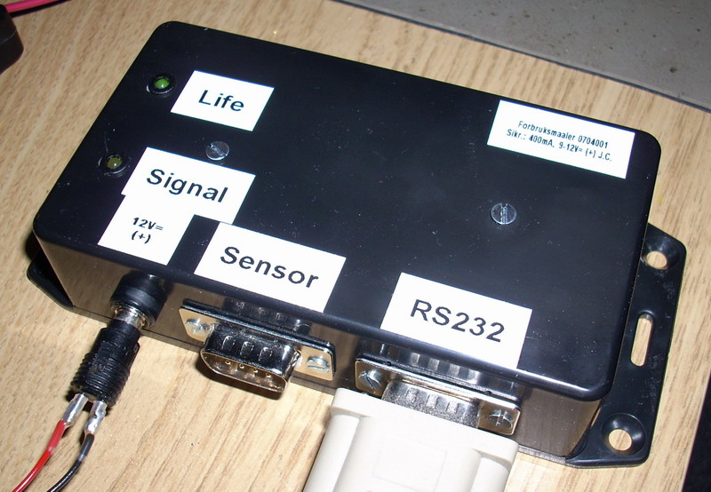

## Source code for project: [Home power consumption measuring unit](https://link.stdout.no/R)

Measures the power consumption by counting LED pulses from the home fuse box. Measurements can be read via a serial interface, uses the AVR ATtiny2313 microcontroller.

Written in basic, using [Bascom-AVR](http://www.mcselec.com/).

### Author
[Thomas Jensen](https://thomas.stdout.no)
